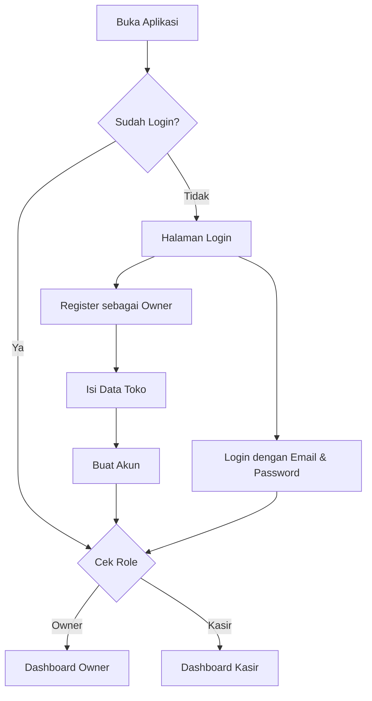
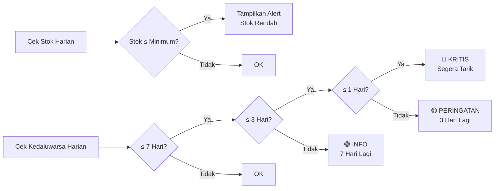
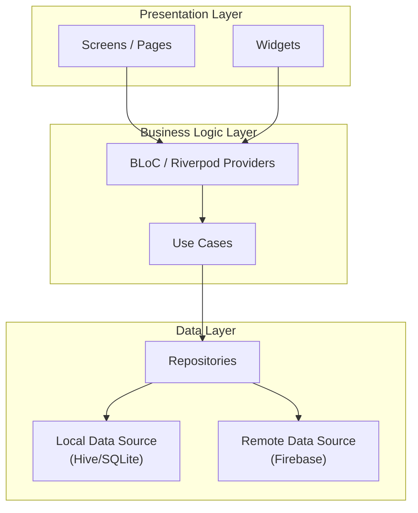
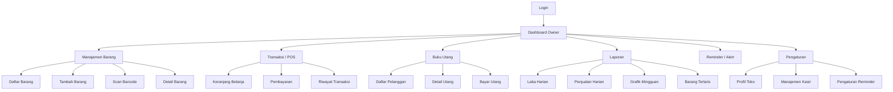
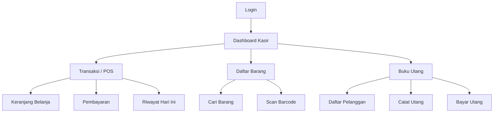

# 📋 Product Requirements Document (PRD)
# **StokWarung** — Inventory & POS Sederhana untuk Warung

---

## 1. Ringkasan Produk

| Item | Detail |
|---|---|
| **Nama Aplikasi** | StokWarung |
| **Kategori** | Inventory UMKM Mikro / SMB SaaS |
| **Platform** | Android (prioritas), iOS, Web |
| **Tech Stack** | Flutter + Firebase (Auth, Firestore, Cloud Functions) |
| **Target User** | Pemilik warung kecil / toko kelontong yang belum menggunakan sistem POS |
| **Monetisasi** | Freemium, langganan murah, atau paket fitur laporan |
| **Versi** | 1.0.0 (MVP) |

---

## 2. Latar Belakang & Masalah

Warung kecil di Indonesia banyak yang belum memakai POS kompleks. Pencatatan stok masih dilakukan secara manual (buku tulis), sehingga sering terjadi:

- **Stok tidak terdata** — barang habis tanpa disadari
- **Barang kedaluwarsa** — tidak ada reminder tanggal expired
- **Utang pelanggan tidak tercatat** — piutang hilang/lupa
- **Laba tidak jelas** — tidak ada laporan harian yang mudah dibaca
- **Margin tidak terpantau** — tidak tahu mana barang yang untung besar atau kecil

**StokWarung** hadir sebagai solusi ringan, berbahasa Indonesia sederhana, dan mudah digunakan oleh siapa saja.

---

## 3. Tujuan Produk

1. Menyediakan pencatatan stok barang sederhana dengan dukungan barcode
2. Memberikan reminder otomatis untuk stok hampir habis dan barang mendekati kedaluwarsa
3. Menyediakan buku utang pelanggan digital
4. Menghasilkan laporan laba harian yang mudah dipahami pemilik warung
5. Membedakan akses antara **Owner** (pemilik) dan **Kasir** (karyawan)

---

## 4. User Roles & Permissions

### 4.1 Owner (Pemilik Warung)

> Akses penuh ke semua fitur aplikasi

| Fitur | Akses |
|---|---|
| Dashboard ringkasan | ✅ |
| Manajemen barang (CRUD) | ✅ |
| Scan barcode | ✅ |
| Set harga beli, harga jual, margin | ✅ |
| Lihat & kelola stok | ✅ |
| Reminder stok & kedaluwarsa | ✅ |
| Transaksi penjualan (kasir) | ✅ |
| Buku utang pelanggan (CRUD) | ✅ |
| Laporan laba harian | ✅ |
| Laporan penjualan | ✅ |
| Manajemen user (tambah/hapus kasir) | ✅ |
| Pengaturan toko | ✅ |
| Export data (PDF/Excel) | ✅ |

### 4.2 Kasir (Karyawan)

> Akses terbatas hanya pada operasional harian

| Fitur | Akses |
|---|---|
| Dashboard ringkasan (terbatas) | ✅ |
| Lihat daftar barang | ✅ |
| Scan barcode | ✅ |
| Transaksi penjualan | ✅ |
| Lihat stok barang | ✅ |
| Catat utang pelanggan | ✅ |
| Lihat utang pelanggan | ✅ |
| Edit/hapus barang | ❌ |
| Set harga beli/jual | ❌ |
| Laporan laba harian | ❌ |
| Laporan penjualan detail | ❌ |
| Manajemen user | ❌ |
| Pengaturan toko | ❌ |
| Export data | ❌ |

---

## 5. Fitur Detail (MVP)

### 5.1 🔐 Autentikasi & Onboarding

| ID | Fitur | Deskripsi | Role |
|---|---|---|---|
| AUTH-01 | Register Owner | Registrasi akun owner dengan nama toko, email, dan password | Owner |
| AUTH-02 | Login | Login dengan email & password | Semua |
| AUTH-03 | Tambah Kasir | Owner membuat akun kasir dengan username & PIN/password | Owner |
| AUTH-04 | Pilih Role | Sistem otomatis mengarahkan ke dashboard sesuai role setelah login | Semua |
| AUTH-05 | Logout | Keluar dari akun | Semua |
| AUTH-06 | Lupa Password | Reset password via email | Semua |

#### User Flow — Registrasi & Login



---

### 5.2 📦 Manajemen Barang & Stok

| ID | Fitur | Deskripsi | Role |
|---|---|---|---|
| STK-01 | Tambah Barang | Input nama, barcode, kategori, satuan, harga beli, harga jual, stok awal, tanggal kedaluwarsa | Owner |
| STK-02 | Scan Barcode | Scan barcode produk untuk input cepat atau pencarian | Owner, Kasir |
| STK-03 | Edit Barang | Ubah informasi barang | Owner |
| STK-04 | Hapus Barang | Hapus barang dari database | Owner |
| STK-05 | Daftar Barang | Lihat semua barang dengan search & filter | Owner, Kasir |
| STK-06 | Detail Barang | Lihat detail lengkap barang termasuk margin | Owner, Kasir |
| STK-07 | Update Stok | Tambah/kurangi stok secara manual (restock) | Owner |
| STK-08 | Kalkulasi Margin | Otomatis hitung margin = harga jual − harga beli | Owner |
| STK-09 | Kategori Barang | Kelompokkan barang (makanan, minuman, sembako, dll) | Owner |

#### Data Model — Barang

```dart
class Barang {
  String id;              // auto-generated
  String barcode;
  String nama;
  String kategori;
  String satuan;          // pcs, kg, liter, dll
  int hargaBeli;
  int hargaJual;
  int margin;             // computed: hargaJual - hargaBeli
  double marginPersen;    // computed: margin / hargaBeli * 100
  int stok;
  int stokMinimum;        // threshold untuk reminder
  DateTime? tanggalKedaluwarsa;  // nullable, tidak semua barang punya
  String? gambar;         // URL gambar, opsional
  DateTime createdAt;
  DateTime updatedAt;
}
```

---

### 5.3 🔔 Reminder & Notifikasi

| ID | Fitur | Deskripsi | Role |
|---|---|---|---|
| REM-01 | Reminder Stok Hampir Habis | Notifikasi ketika stok barang ≤ batas minimum | Owner |
| REM-02 | Reminder Kedaluwarsa | Notifikasi barang yang mendekati tanggal kedaluwarsa (H-7, H-3, H-1) | Owner |
| REM-03 | Badge Notifikasi | Tampilkan jumlah notifikasi aktif di ikon lonceng | Owner |
| REM-04 | Daftar Alert | Halaman daftar semua barang yang perlu perhatian | Owner |

#### Logika Reminder



---

### 5.4 🛒 Transaksi Penjualan (POS Sederhana)

| ID | Fitur | Deskripsi | Role |
|---|---|---|---|
| TRX-01 | Buat Transaksi | Mulai transaksi penjualan baru | Owner, Kasir |
| TRX-02 | Tambah Item | Tambahkan barang ke keranjang via search atau scan barcode | Owner, Kasir |
| TRX-03 | Atur Jumlah | Ubah jumlah item dalam keranjang | Owner, Kasir |
| TRX-04 | Hapus Item | Hapus item dari keranjang | Owner, Kasir |
| TRX-05 | Total Otomatis | Hitung total belanja otomatis | Owner, Kasir |
| TRX-06 | Pembayaran Tunai | Input jumlah bayar, hitung kembalian | Owner, Kasir |
| TRX-07 | Pembayaran Utang | Catat sebagai utang ke nama pelanggan | Owner, Kasir |
| TRX-08 | Simpan Transaksi | Simpan transaksi, otomatis kurangi stok | Owner, Kasir |
| TRX-09 | Riwayat Transaksi | Lihat daftar transaksi hari ini | Owner, Kasir |
| TRX-10 | Detail Transaksi | Lihat detail transaksi tertentu | Owner |

#### Data Model — Transaksi

```dart
class Transaksi {
  String id;
  List<TransaksiItem> items;
  int totalHarga;
  int totalModal;           // sum hargaBeli * qty
  int laba;                 // totalHarga - totalModal
  String metodePembayaran;  // tunai / utang
  int? jumlahBayar;
  int? kembalian;
  String? pelangganId;      // jika utang
  String kasirId;
  String kasirNama;
  DateTime createdAt;
}

class TransaksiItem {
  String barangId;
  String namaBarang;
  int hargaJual;
  int hargaBeli;
  int qty;
  int subtotal;
}
```

---

### 5.5 📒 Buku Utang Pelanggan

| ID | Fitur | Deskripsi | Role |
|---|---|---|---|
| UTG-01 | Tambah Pelanggan | Catat nama & nomor HP pelanggan | Owner, Kasir |
| UTG-02 | Catat Utang | Otomatis tercatat dari transaksi utang | Owner, Kasir |
| UTG-03 | Bayar Utang | Catat pembayaran utang (sebagian / lunas) | Owner, Kasir |
| UTG-04 | Daftar Pelanggan | Lihat semua pelanggan yang punya utang | Owner, Kasir |
| UTG-05 | Detail Utang | Lihat riwayat utang per pelanggan | Owner, Kasir |
| UTG-06 | Total Piutang | Lihat total piutang keseluruhan | Owner |
| UTG-07 | Hapus Pelanggan | Hapus data pelanggan | Owner |

#### Data Model — Utang

```dart
class Pelanggan {
  String id;
  String nama;
  String? noHp;
  int totalUtang;     // computed
  DateTime createdAt;
}

class Utang {
  String id;
  String pelangganId;
  String? transaksiId;
  int jumlah;
  String tipe;        // utang / bayar
  String? keterangan;
  DateTime createdAt;
}
```

---

### 5.6 📊 Laporan

| ID | Fitur | Deskripsi | Role |
|---|---|---|---|
| LAP-01 | Laporan Laba Harian | Ringkasan laba per hari (total penjualan − total modal) | Owner |
| LAP-02 | Laporan Penjualan Harian | Daftar semua transaksi hari ini | Owner |
| LAP-03 | Laporan Mingguan | Grafik tren penjualan & laba 7 hari terakhir | Owner |
| LAP-04 | Laporan Bulanan | Ringkasan penjualan & laba per bulan | Owner |
| LAP-05 | Barang Terlaris | Ranking barang paling banyak terjual | Owner |
| LAP-06 | Barang Margin Tertinggi | Ranking barang dengan margin keuntungan terbesar | Owner |
| LAP-07 | Export PDF | Export laporan ke format PDF | Owner |

#### Contoh Tampilan — Laporan Laba Harian

```
╔══════════════════════════════════════╗
║     📊 LAPORAN LABA HARIAN          ║
║     Kamis, 5 Juni 2026              ║
╠══════════════════════════════════════╣
║  Total Penjualan    : Rp 2.450.000  ║
║  Total Modal        : Rp 1.890.000  ║
║  ─────────────────────────────────── ║
║  💰 LABA BERSIH     : Rp   560.000  ║
║                                      ║
║  Jumlah Transaksi   : 47            ║
║  Rata-rata / Trx    : Rp    52.128  ║
║                                      ║
║  Pembayaran Tunai   : Rp 2.100.000  ║
║  Pembayaran Utang   : Rp   350.000  ║
╚══════════════════════════════════════╝
```

---

### 5.7 ⚙️ Pengaturan

| ID | Fitur | Deskripsi | Role |
|---|---|---|---|
| SET-01 | Profil Toko | Nama toko, alamat, nomor HP | Owner |
| SET-02 | Manajemen Kasir | Tambah, nonaktifkan, hapus akun kasir | Owner |
| SET-03 | Ubah Password | Ganti password akun sendiri | Semua |
| SET-04 | Stok Minimum Default | Set batas minimum stok default untuk barang baru | Owner |
| SET-05 | Pengaturan Reminder | Atur kapan reminder kedaluwarsa dikirim (H-7, H-3, H-1) | Owner |

---

## 6. Arsitektur Teknis

### 6.1 Tech Stack

| Layer | Teknologi |
|---|---|
| **Frontend** | Flutter (Dart) |
| **State Management** | Riverpod / BLoC |
| **Backend** | Firebase (Firestore, Auth, Cloud Functions) |
| **Local Storage** | Hive / SQLite (offline-first) |
| **Barcode Scanner** | `mobile_scanner` package |
| **Notifikasi** | Firebase Cloud Messaging (FCM) + Local Notifications |
| **Laporan PDF** | `pdf` + `printing` package |
| **Charts** | `fl_chart` package |

### 6.2 Arsitektur Aplikasi



### 6.3 Struktur Folder

```
lib/
├── main.dart
├── app/
│   ├── app.dart
│   ├── routes.dart
│   └── theme.dart
├── core/
│   ├── constants/
│   ├── utils/
│   ├── widgets/              # shared widgets
│   └── services/
│       ├── auth_service.dart
│       ├── notification_service.dart
│       └── barcode_service.dart
├── features/
│   ├── auth/
│   │   ├── data/
│   │   ├── domain/
│   │   └── presentation/
│   ├── dashboard/
│   │   ├── data/
│   │   ├── domain/
│   │   └── presentation/
│   ├── barang/               # manajemen barang & stok
│   │   ├── data/
│   │   │   ├── models/
│   │   │   ├── repositories/
│   │   │   └── datasources/
│   │   ├── domain/
│   │   │   ├── entities/
│   │   │   ├── repositories/
│   │   │   └── usecases/
│   │   └── presentation/
│   │       ├── bloc/
│   │       ├── pages/
│   │       └── widgets/
│   ├── transaksi/            # POS / penjualan
│   │   ├── data/
│   │   ├── domain/
│   │   └── presentation/
│   ├── utang/                # buku utang pelanggan
│   │   ├── data/
│   │   ├── domain/
│   │   └── presentation/
│   ├── laporan/              # laporan & analytics
│   │   ├── data/
│   │   ├── domain/
│   │   └── presentation/
│   ├── reminder/             # notifikasi stok & kedaluwarsa
│   │   ├── data/
│   │   ├── domain/
│   │   └── presentation/
│   └── settings/             # pengaturan toko & user
│       ├── data/
│       ├── domain/
│       └── presentation/
└── l10n/                     # localization - Bahasa Indonesia
```

---

## 7. Navigasi & Screen Map

### 7.1 Navigasi Owner



### 7.2 Navigasi Kasir



---

## 8. Wireframe — Layout Utama

### 8.1 Dashboard Owner

```
┌──────────────────────────────────┐
│  🏪 Warung Pak Budi        🔔 3 │
├──────────────────────────────────┤
│                                  │
│  ┌──────────┐  ┌──────────┐     │
│  │ 💰       │  │ 📦       │     │
│  │ Laba     │  │ Total    │     │
│  │ Hari Ini │  │ Barang   │     │
│  │ Rp560rb  │  │ 234      │     │
│  └──────────┘  └──────────┘     │
│                                  │
│  ┌──────────┐  ┌──────────┐     │
│  │ 🛒       │  │ 📒       │     │
│  │ Transaksi│  │ Total    │     │
│  │ Hari Ini │  │ Piutang  │     │
│  │ 47       │  │ Rp1.2jt  │     │
│  └──────────┘  └──────────┘     │
│                                  │
│  ⚠️ Perlu Perhatian              │
│  ┌──────────────────────────┐   │
│  │ 🔴 Gula Pasir - Stok: 2 │   │
│  │ 🟡 Mie Instan - Exp 3hr │   │
│  │ 🟢 Teh Botol - Exp 7hr  │   │
│  └──────────────────────────┘   │
│                                  │
├────────┬────────┬────────┬──────┤
│  🏠   │  📦   │  🛒   │  📊  │
│ Home   │ Barang │ Kasir  │Lapor │
└────────┴────────┴────────┴──────┘
```

### 8.2 Dashboard Kasir

```
┌──────────────────────────────────┐
│  🏪 Warung Pak Budi    👤 Kasir │
├──────────────────────────────────┤
│                                  │
│  ┌──────────────────────────┐   │
│  │     🛒 MULAI TRANSAKSI   │   │
│  │     Ketuk untuk mulai     │   │
│  └──────────────────────────┘   │
│                                  │
│  Transaksi Hari Ini: 12         │
│                                  │
│  ┌──────────────────────────┐   │
│  │ 📦 Cari Barang / Scan    │   │
│  └──────────────────────────┘   │
│                                  │
│  ┌──────────────────────────┐   │
│  │ 📒 Buku Utang Pelanggan  │   │
│  └──────────────────────────┘   │
│                                  │
├──────────┬──────────┬───────────┤
│   🏠    │   🛒    │   📒     │
│  Home    │  Kasir   │  Utang   │
└──────────┴──────────┴───────────┘
```

---

## 9. Non-Functional Requirements

| Aspek | Requirement |
|---|---|
| **Performa** | Waktu buka halaman < 2 detik, scan barcode < 1 detik |
| **Offline-First** | Aplikasi harus bisa digunakan tanpa internet. Sync saat online |
| **Bahasa** | Bahasa Indonesia sederhana, mudah dipahami |
| **Keamanan** | Data terenkripsi, PIN kasir, session timeout 30 menit |
| **Ukuran APK** | < 30 MB |
| **Kompatibilitas** | Android 7.0+ (API 24), iOS 13+ |
| **Backup** | Auto backup ke cloud setiap hari |
| **Responsif** | Optimal untuk layar 5"–7" (smartphone) |

---

## 10. Milestone & Timeline

### Phase 1 — MVP (Minggu 1–4)

| Minggu | Deliverables |
|---|---|
| **Minggu 1** | Setup project, Auth (login/register), database schema, theme & design system |
| **Minggu 2** | Manajemen barang (CRUD), scan barcode, kategori |
| **Minggu 3** | Transaksi penjualan (POS), buku utang pelanggan |
| **Minggu 4** | Laporan laba harian, reminder stok & kedaluwarsa, pengaturan |

### Phase 2 — Polish & Enhancement (Minggu 5–6)

| Minggu | Deliverables |
|---|---|
| **Minggu 5** | Grafik laporan mingguan/bulanan, export PDF, UI polish |
| **Minggu 6** | Testing, bug fixes, optimasi performa, persiapan Play Store |

### Phase 3 — Post-Launch (Opsional)

- Fitur multi-toko
- Integrasi pembayaran QRIS
- Cetak struk via Bluetooth thermal printer
- Manajemen supplier
- Fitur promo / diskon

---

## 11. Success Metrics (KPI)

| Metric | Target |
|---|---|
| **MAU** (Monthly Active Users) | 1.000 dalam 3 bulan pertama |
| **Retention Rate** (D7) | > 40% |
| **Rata-rata Transaksi / User / Hari** | > 10 |
| **Rating Play Store** | > 4.2 ⭐ |
| **Crash Rate** | < 1% |
| **Time to First Transaction** | < 5 menit setelah install |

---

## 12. Risiko & Mitigasi

| Risiko | Dampak | Mitigasi |
|---|---|---|
| User tidak terbiasa teknologi | Tinggi | UI sangat sederhana, onboarding tutorial, bahasa sehari-hari |
| Internet tidak stabil | Tinggi | Offline-first architecture, sync otomatis saat online |
| Barcode tidak terbaca | Sedang | Fallback ke input manual, support multi-format barcode |
| Data hilang | Tinggi | Auto-backup harian, cloud sync |
| Persaingan dengan app sejenis | Sedang | Fokus pada kesederhanaan & bahasa Indonesia |

---

## 13. Dependencies & Packages (Flutter)

```yaml
dependencies:
  flutter:
    sdk: flutter
  
  # State Management
  flutter_riverpod: ^2.x.x         # atau flutter_bloc
  
  # Firebase
  firebase_core: ^3.x.x
  firebase_auth: ^5.x.x
  cloud_firestore: ^5.x.x
  firebase_messaging: ^15.x.x
  
  # Local Storage
  hive: ^4.x.x
  hive_flutter: ^2.x.x
  
  # Barcode
  mobile_scanner: ^6.x.x
  
  # UI
  fl_chart: ^0.x.x                 # Charts & grafik
  google_fonts: ^6.x.x
  flutter_local_notifications: ^18.x.x
  
  # Utils
  intl: ^0.x.x                     # Format tanggal & mata uang
  pdf: ^3.x.x                      # Generate PDF
  printing: ^5.x.x                 # Print / share PDF
  uuid: ^4.x.x
  
  # Navigation
  go_router: ^14.x.x
```

---

## 14. Catatan Tambahan

> **Bahasa Aplikasi**: Semua teks dalam aplikasi menggunakan **Bahasa Indonesia sederhana** agar mudah dipahami oleh target user (pemilik warung kecil).

> **MVP Focus**: PRD ini mencakup fitur MVP (Minimum Viable Product) berdasarkan requirement utama. Fitur-fitur di Phase 3 bersifat opsional dan dapat dikembangkan setelah MVP berhasil diluncurkan.

> **Offline-First**: Arsitektur offline-first sangat penting karena banyak warung kecil di daerah dengan koneksi internet tidak stabil.

---

*Dokumen ini dibuat pada: 5 Juni 2026*  
*Versi Dokumen: 1.0*
